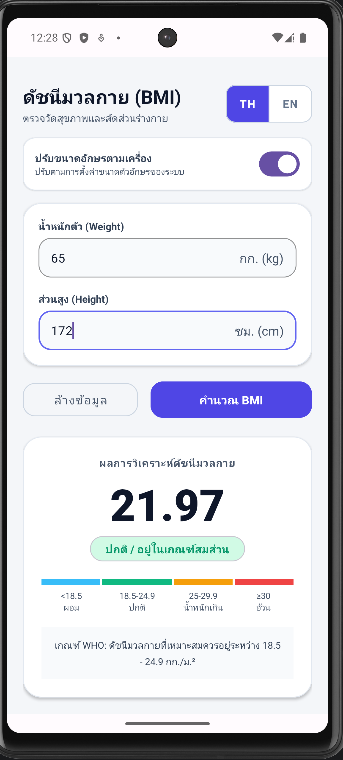
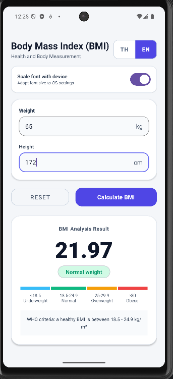

#  CS364 - Assignment 1: BMI Calculator (ดัชนีมวลกาย)

แอปพลิเคชันสำหรับคำนวณค่าดัชนีมวลกาย (Body Mass Index : BMI) บนระบบปฏิบัติการ Android พัฒนาสำหรับรายวิชา CS364 มหาวิทยาลัยธรรมศาสตร์ อ้างอิงเกณฑ์การคำนวณและจำแนกตามองค์การอนามัยโลก (WHO) จาก [calculator.net/bmi-calculator](https://www.calculator.net/bmi-calculator.html)

---

##  รายชื่อและหน้าที่ของสมาชิกในกลุ่ม

| ลำดับ | ชื่อ - นามสกุล | รหัสนักศึกษา | หน้าที่และความรับผิดชอบ |
|:---:|:---|:---:|:---|
| 1 | นาย สุทธิพจน์ สุวรรณสุทธิ์ | 6709650698 | คุมงาน (Project Manager), ควบคุมคุณภาพ (Quality Assurance & Inspection) |
| 2 | นาย ศุภวิชญ์ ไม้จัตุรัส | 6709650656 | ระบบภาษาของแอปพลิเคชัน (Localization TH/EN), ตรรกะการคำนวณ (Calculate Correctly, Calculate Again) |
| 3 | นาย วุฒิกร บุญทวี | 6709650623 | ออกแบบและจัดโครงสร้าง Layout แบบ Responsive (Portrait + Landscape) |
| 4 | นาย พลธรรม ศรีงาม | 6709650508 | ออกแบบและจัดโครงสร้าง Layout แบบ Responsive (Portrait + Landscape) |
| 5 | นาย สหรัฐ อุดมวัฒน์ทวี | 6709650680 | การตรวจสอบข้อมูลนำเข้า (Input Validation), ระดับภาวะเสี่ยง (BMI Risk Level), การปรับขนาดอักษรตามเครื่อง (Runtime Font Scale) |

---

##  ตัวอย่างการคำนวณและการแสดงผล (UI Preview - TH / EN)

  <table>
    <tr>
      <th align="center">🇹🇭 ภาษาไทย (Thai Mode)</th>
      <th align="center">🇬🇧 ภาษาอังกฤษ (English Mode)</th>
    </tr>
    <tr>
      <td align="center">
        
      </td>
      <td align="center">
        
      </td>
    </tr>
  </table>

---

##  ความต้องการของระบบและการเปิดใช้งาน
- **Min SDK**: 28 (Android 9.0 Pie ขึ้นไป)
- **Target SDK**: 36 (Android 15+)
- **Compile SDK**: 36
- **IDE**: Android Studio Ladybug / Meerkat
